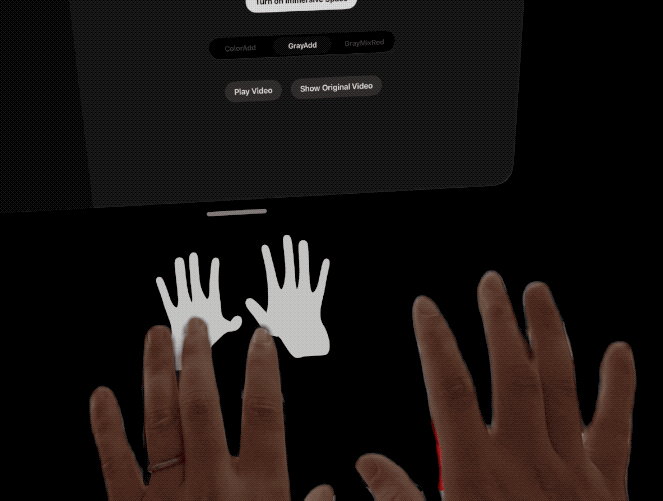
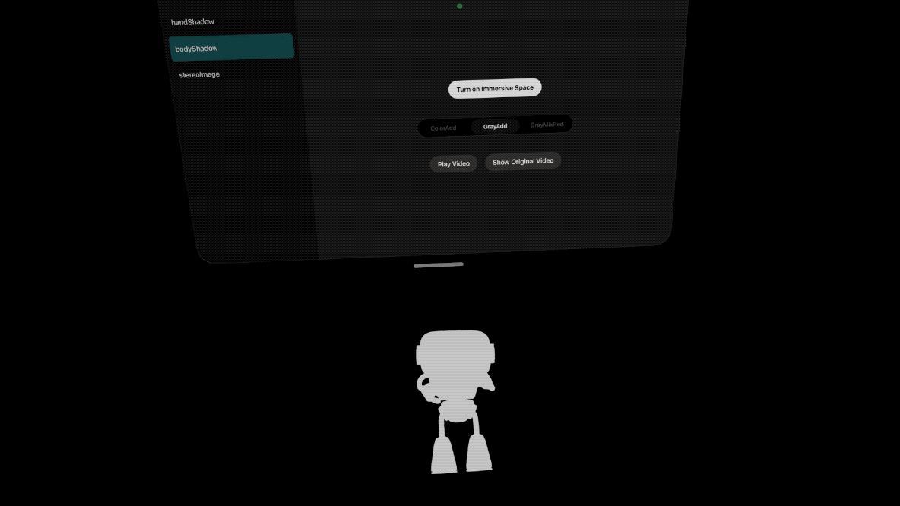
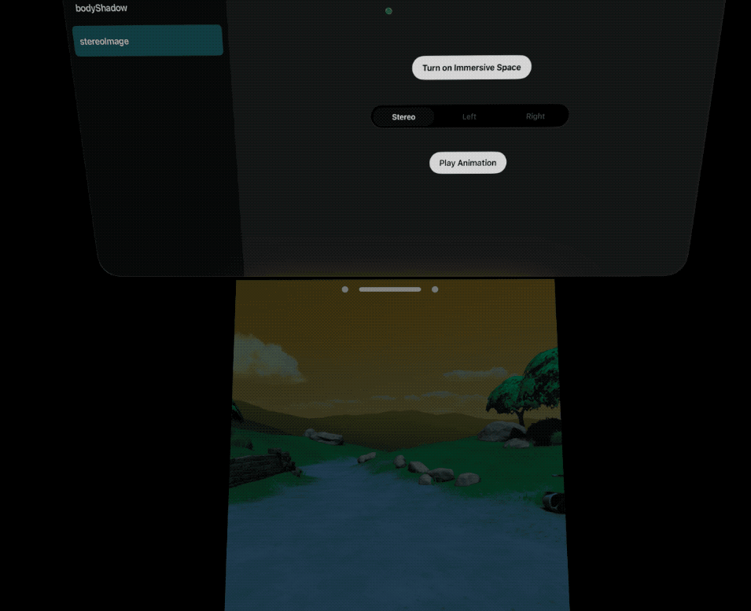

# RealityShadowPuppetry
**RealityShadowPuppetry** 演示了：如何在 RealityKit 和 visionOS 中利用 **自定义相机**，实现 **离屏渲染** 功能。

**RealityShadowPuppetry** showcases **off-screen rendering** in RealityKit and visionOS using **custom camera**.

**Key Features**：

* **Hand Shadow**：离屏渲染与手部追踪结合，实现类似 **手影** 的效果。Combines off-screen rendering with hand tracking to create an effect similar to **hand shadow**
* **Body Shadow**：离屏渲染和 IK 系统结合，实现类似 **身体投影** 的效果。 Combines off-screen rendering with an IK (Inverse Kinematics) system to create a **body shadow**.
* **Stereoscopic 3D Image** ：左右双相机离屏渲染和 ShaderGraph 结合，实现类似 3D 电影的 **双目视差影像** 效果。 Combines dual left/right camera off-screen rendering with Shader Graph to create a **stereoscopic image** effect, similar to those in 3D movies.

## 手影 HandShadow

## 身影 BodyShadow

## 双目视差影像 StereoImage

